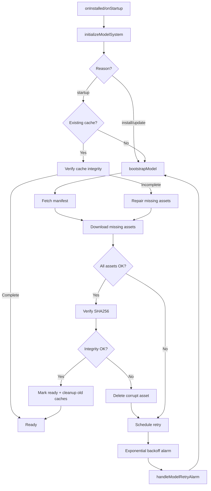

# Model Download & Caching System

## Overview

This implementation provides a robust model download and caching system for the Chrome AI extension. It ensures that embedding model assets are downloaded once, cached locally in CacheStorage, and verified for integrity before use.

## Architecture

### Components

1. **`src/constants.ts`**: Configuration and type definitions
   - Model URLs and version
   - Cache naming conventions
   - Retry configuration
   - Manifest and error types

2. **`src/background/model-ready.ts`**: Core caching logic
   - Manifest fetching and validation
   - Asset download with integrity verification (SHA256)
   - Cache management (CacheStorage API)
   - Exponential backoff retry with alarms
   - Readiness gating API

3. **`src/background.ts`**: Bootstrap orchestration
   - Install/update lifecycle hooks
   - Alarm handling for retries
   - Message routing for model status checks

4. **`src/offscreen/bridge.ts`**: Worker gating
   - Checks model readiness before starting worker
   - Prevents worker creation until assets ready

5. **`src/workers/embed-worker.ts`**: Asset loading
   - Loads model files from cache using blob URLs
   - Placeholder for actual embedding model

## Features

### One-Time Bootstrap Download

- **First Install**: Downloads all model assets from CDN
- **Version Upgrade**: Detects version mismatches and downloads new assets
- **Atomic Switch**: Old cache remains usable until new version fully verified

### Cache Integrity Verification

- **SHA256 Hashing**: Every asset verified against manifest hash
- **Partial Repair**: Only missing/corrupt assets re-downloaded
- **Integrity Mismatch**: Corrupt assets rejected, never marked ready

### Offline-First Operation

- **After Bootstrap**: Zero network requests for embeddings
- **Cache Persistence**: CacheStorage survives service worker restarts
- **Offline Detection**: Graceful degradation when offline during bootstrap

### Exponential Backoff Retry

- **Alarm-Based**: Uses `chrome.alarms` for persistent retries
- **Backoff Schedule**: 1, 2, 4, 8, 16, ... up to 60 minutes
- **Max Attempts**: Stops after 10 failed attempts
- **Reset on Success**: Any successful download resets counter

### Cache Layout

```
CacheStorage
└── model/1.0.0/
    ├── /1.0.0/manifest.json
    ├── /1.0.0/model.onnx
    ├── /1.0.0/tokenizer.json
    ├── /1.0.0/config.json
    └── /1.0.0/vocab.txt
```

## Storage Keys

All state stored in `chrome.storage.local`:

| Key | Type | Description |
|-----|------|-------------|
| `model.version` | `string` | Currently deployed version |
| `model.ready` | `boolean` | True only after all assets verified |
| `model.bootstrapState` | `'idle' \| 'checking' \| 'downloading' \| 'verifying' \| 'ready' \| 'error'` | Current bootstrap state |
| `model.error` | `{ code, message, at }` | Last bootstrap error |
| `model.lastCheckAt` | `number` | Timestamp of last check |
| `model.pendingVersion` | `string?` | Version being downloaded |
| `model.assetETags` | `Record<string,string>` | ETag per asset for 304 checks |
| `model.retryCount` | `number` | Current retry attempt |

## Manifest Schema

Hosted at `${MODEL_BASE_URL}/${version}/manifest.json`:

```json
{
  "version": "1.0.0",
  "assets": [
    {
      "path": "model.onnx",
      "size": 123456789,
      "sha256": "abc123...",
      "optional": false
    },
    {
      "path": "tokenizer.json",
      "size": 12345,
      "sha256": "def456..."
    }
  ],
  "expires": "2025-12-31T00:00:00Z",
  "minAppVersion": "0.1.0"
}
```

## API

### Public Functions

#### `ensureModelReady(): Promise<void>`

Gate all embedding calls on this function. It will:
- Return immediately if model ready
- Trigger bootstrap if needed
- Throw if bootstrap in progress or failed

**Throws:**
- `MODEL_BOOTSTRAP_IN_PROGRESS`: Bootstrap currently running
- `MODEL_NOT_READY: ${reason}`: Bootstrap failed or incomplete
- `MODEL_NOT_READY_OFFLINE`: First-run offline (no cached assets)

**Usage:**
```typescript
await ensureModelReady();
// Safe to call embedding functions now
```

#### `getModelCacheUrl(assetPath: string): Promise<string>`

Get a blob URL for a cached model asset.

**Parameters:**
- `assetPath`: Relative path from manifest (e.g., `'model.onnx'`)

**Returns:**
- Blob URL (e.g., `blob:chrome-extension://...`)

**Throws:**
- `Model not ready`: Called before bootstrap complete
- `Asset not found in cache: ${path}`: Asset missing

**Usage:**
```typescript
const modelUrl = await getModelCacheUrl('model.onnx');
const response = await fetch(modelUrl);
const blob = await response.blob();
// Load model from blob
```

#### `isModelReady(): Promise<boolean>`

Check readiness without triggering bootstrap.

**Returns:**
- `true` if model assets cached and verified
- `false` otherwise

#### `getModelDebugInfo(): Promise<object>`

Get internal state for debugging.

**Returns:**
```typescript
{
  version: string,
  ready: boolean,
  bootstrapState: ModelBootstrapState,
  error?: ModelError,
  lastCheckAt?: number,
  pendingVersion?: string,
  assetETags: Record<string, string>,
  retryCount: number,
  targetVersion: string,
  availableCaches: string[]
}
```

#### `initializeModelSystem(reason: string): Promise<void>`

Called by background on `onInstalled` or `onStartup`.

**Parameters:**
- `reason`: `'install'`, `'update'`, `'startup'`, etc.

**Behavior:**
- `install` | `update`: Triggers bootstrap
- Other: Verifies existing cache, repairs if incomplete

#### `handleModelRetryAlarm(): Promise<void>`

Called by background when `'model-retry'` alarm fires.

## Bootstrap Flow



## Error Handling

### Error Codes

| Code | Retriable | Description |
|------|-----------|-------------|
| `BOOTSTRAP_FAILED` | Yes | Network or fetch error |
| `INTEGRITY_MISMATCH` | No | SHA256 hash mismatch (server must fix) |
| `MAX_RETRIES_EXCEEDED` | No | Gave up after 10 attempts |
| `MODEL_NOT_READY_OFFLINE` | Yes | First-run offline |

### Retry Strategy

1. **Immediate Failure**: Set `bootstrapState = 'error'`
2. **Check Retriability**: Non-retriable errors (integrity) stop here
3. **Schedule Alarm**: `chrome.alarms.create('model-retry', { delayInMinutes: backoff })`
4. **Increment Counter**: `retryCount++`
5. **Wait for Alarm**: Background calls `handleModelRetryAlarm()` on fire
6. **Retry**: Call `bootstrapModel()` again
7. **Success**: Reset `retryCount = 0`, clear alarm

### Backoff Schedule

| Attempt | Delay |
|---------|-------|
| 1 | 1 min |
| 2 | 2 min |
| 3 | 4 min |
| 4 | 8 min |
| 5 | 16 min |
| 6 | 32 min |
| 7+ | 60 min (capped) |

## Testing

### Manual QA Checklist

- [ ] **First install online**: Downloads all assets, sets `ready=true`, embeddings work, no further network
- [ ] **First install offline**: Stays `ready=false`, retries on backoff, becomes ready when online
- [ ] **Version bump online**: Downloads new version, old remains usable until switch, atomically deletes old cache
- [ ] **Integrity mismatch**: Corrupt asset rejected, not ready until server fixes
- [ ] **Partial cache recovery**: Delete one asset, only that file re-fetched
- [ ] **ETag hit**: Server returns 304, asset not re-downloaded
- [ ] **Restart robustness**: Service worker restarts don't lose state
- [ ] **No network after ready**: Embeddings load from cache with zero network
- [ ] **Error backoff**: Verify exponential schedule, cap at 60 min
- [ ] **Max retries**: Stops after 10 attempts, remains in error state

### Debug Commands

Check model state:
```javascript
chrome.runtime.sendMessage({ type: 'GetModelDebugInfo' }, console.log);
```

Force re-bootstrap:
```javascript
await chrome.storage.local.remove([
  'model.version',
  'model.ready',
  'model.bootstrapState'
]);
// Then reload extension
```

Inspect cache:
```javascript
caches.keys().then(console.log);
caches.open('model/1.0.0').then(c => c.keys()).then(console.log);
```

## Configuration

Update these constants in `src/constants.ts`:

```typescript
export const MODEL_BASE_URL = 'https://cdn.example.com/models'; // TODO: Set actual CDN
export const MODEL_VERSION = '1.0.0'; // Bump to trigger upgrade
```

## Future Enhancements

- [ ] Streaming progress events during download
- [ ] Delta updates for incremental model changes
- [ ] Multiple model versions side-by-side
- [ ] Compression/decompression of assets
- [ ] Selective asset download based on device capabilities
- [ ] Prefetch on idle for faster upgrades
- [ ] Background model warming on install

## Implementation Status

✅ Constants and types defined  
✅ Core caching and integrity verification  
✅ Bootstrap orchestration with retries  
✅ Offscreen bridge gating  
✅ Worker placeholder with asset loading pattern  
🔲 Actual embedding model integration (requires ONNX Runtime or Transformers.js)  
🔲 Real CDN URL and manifest hosting  
🔲 Acceptance tests  

## References

- [CacheStorage API](https://developer.mozilla.org/en-US/docs/Web/API/CacheStorage)
- [SubtleCrypto.digest()](https://developer.mozilla.org/en-US/docs/Web/API/SubtleCrypto/digest)
- [Chrome Alarms API](https://developer.chrome.com/docs/extensions/reference/alarms/)
- [Chrome Offscreen Documents](https://developer.chrome.com/docs/extensions/reference/offscreen/)
