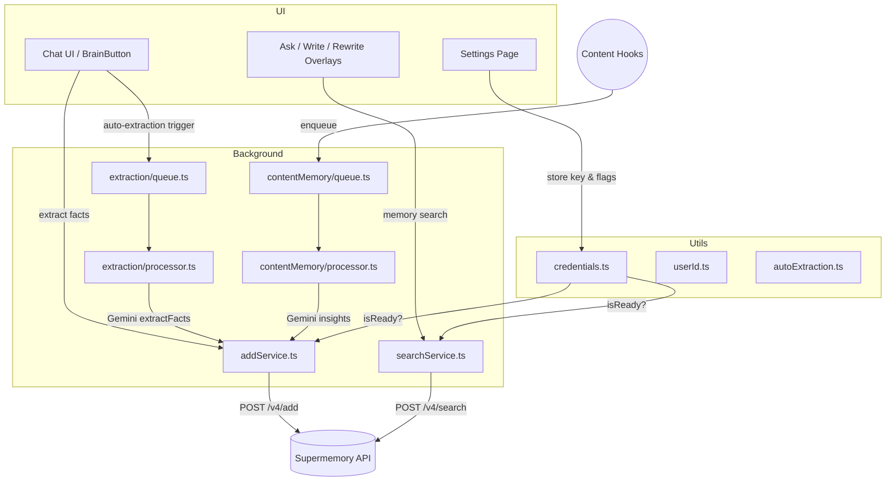

# Supermemory Integration Guide



This document explains how **Supermemory** is integrated into the Chrome-AI code-base, which modules depend on it, and the edge-cases we currently handle.

---
## 1. Overview

Supermemory is an external service that stores user-approved memories (facts, preferences, personal context) and offers a semantic search API. In Chrome-AI it is used to:

1. Persist user knowledge across sessions ("Add Memory" flows)
2. Retrieve relevant memories during AI generation (Writer, Rewriter, Asker)
3. Perform automatic background extraction from chat threads (Auto-Memory Extraction)
4. Build long-term **Content Memory** from page interactions (Content Memory subsystem)

Integration spans **utils**, **background workers**, **content scripts**, and **UI components**.

```
src/
│
├─ utils/
│   └─ supermemory/
│       ├─ credentials.ts      # store / fetch API key
│       ├─ userId.ts           # persistent anonymous userId per profile
│       ├─ autoExtraction.ts   # feature-flag & settings helpers
│       └─ extractionTrigger.ts# heuristics to trigger extraction from chats
│
├─ background/
│   └─ supermemory/
│       ├─ searchService.ts    # direct REST search client
│       ├─ functionDeclaration.ts # Gemini function-calling schema
│
│       ├─ extraction/
│       │   ├─ extractionService.ts # call Gemini to extract facts from messages
│       │   ├─ addService.ts        # Post extracted facts to Supermemory
│       │   ├─ queue.ts             # persistent queue in chrome.storage.local
│       │   ├─ processor.ts         # alarm-driven worker that drains queue
│       │   ├─ startup.ts           # recovery on browser restart
│       │   └─ types.ts
│       └─ contentMemory/
│           ├─ queue.ts       # interaction queue (max 50, retry ≤3)
│           ├─ processor.ts   # summarises page interactions → facts → addService
│           ├─ startup.ts     # resets stuck items after crash / restart
│           ├─ hooks.ts       # chrome.tabs listeners that enqueue items
│           ├─ prompts.ts     # templated Gemini prompts for insight extraction
│           └─ types.ts
│
├─ background/asker/  (geminiAsker.ts)
├─ background/rewriter/ (geminiRewriter.ts)
├─ background/writer/   (geminiWriter.ts)
└─ ...
```

---
## 2. Configuration & Utilities

### 2.1 Storing the API Key
• File: `utils/supermemory/credentials.ts`
• chrome.storage.local key: `supermemory:apiKey`
• Functions:
  - `setSupermemoryApiKey(apiKey)` – persists key, logs result
  - `getSupermemoryApiKey()` – retrieves key
  - `clearSupermemoryApiKey()` – removes key

### 2.2 User Identifier
• File: `utils/supermemory/userId.ts`
• Persists a UUID v4 under storage key `supermemory:userId` to group memories per-profile.

### 2.3 Readiness Helpers
• `isSupermemoryReady()` (utils/supermemory/index.ts) – true when **both** `supermemoryEnabled` flag **and** valid API key exist.
• Used by UI toggles and all service calls to short-circuit if not configured.

### 2.4 Settings Flags
Located in `types/settings.ts` & `utils/settings/settingsStorage.ts`

| Setting | Purpose | Default |
|---------|---------|---------|
| `supermemoryEnabled` | Master on/off switch | `false` |
| `autoMemoryExtraction` | Enable background extraction from chat threads | `false` |
| `autoMemoryMinMessages` | Min messages before extraction triggers | `4` |

---
## 3. Manual Memory Addition

### 3.1 Brain Button (User-initiated)
Component: `components/features/chat/components/buttons/BrainButton.tsx`
• Allows users to highlight chat messages and click the 🧠 button to extract facts.
• On click, content is sent to `background/supermemory/extraction/addService.ts` via messaging.
• UI displays tooltip states: `analyzing`, `success`, `no-facts`, `error` etc.

### 3.2 `addService.ts`
Key points (file: `background/supermemory/extraction/addService.ts`):
1. `addFactToSupermemory(fact, metadata)` – wraps POST to `https://api.supermemory.ai/v4/add`.
2. `addFactsBatch(facts[])` – bulk add with per-fact fallback.
3. Handles errors: 401/403 (invalid key), 413 (payload too large), 429 (rate-limit).
4. Sanitises facts, enforces max length 1 kB each; discards empty facts.

---
## 4. Memory Search (Retrieval)

### 4.1 `searchService.ts`
• Function `searchMemories({query, limit, threshold, rerank})`
• Adds `containerTag` = userId for isolation.
• Handles error codes (401/403 invalid key, 429 rate limit, network failure).
• Provides helper `formatMemoriesForPrompt()` to embed results into Gemini prompts.

### 4.2 Gemini Function Calling Support
• `background/supermemory/functionDeclaration.ts` exports `getMemorySearchTool()` – schema for `search_memories` function.
• `geminiWriter`, `geminiRewriter`, `geminiAsker` can include this tool enabling Gemini to call Supermemory autonomously when **no other built-in tools are active** or when `enableSupermemorySearch` is true.
• If built-in tools are active simultaneously, Supermemory search falls back to **pre-search**: we call `searchMemories` from extension, prepend results to user prompt, and pass to Gemini without function calling (Gemini API only allows either tool calling or built-ins, not both).

---
## 5. Auto-Memory Extraction from Chat Threads

### 5.1 Triggering
• `utils/supermemory/extractionTrigger.ts` – tracks chat thread length; once `autoMemoryExtraction` enabled **and** messages ≥ `autoMemoryMinMessages`, it enqueues extraction job via `queueThreadForExtraction()`.

### 5.2 Extraction Queue
• `background/supermemory/extraction/queue.ts`
  - Persists queue in chrome.storage.local under `supermemory:extractionQueue`.
  - Each item has status: `pending` → `processing` → `done` | `failed`.
  - Retries ≤3 then marks failed.

### 5.3 Processor
• `background/supermemory/extraction/processor.ts`
  - Runs via periodic Chrome alarm `memory-extraction-processing` every minute.
  - Pops next `pending` item, switches to `processing` and calls `extractionService`.
  - On success, posts facts with `addFactsBatch`, marks `done`.
  - On failure increments retries; if retries exceed MAX_RETRIES, marks `failed`.

### 5.4 Startup Recovery
• `background/supermemory/extraction/startup.ts` resets any `processing` items to `pending` on browser start to avoid permanent lock.

### 5.5 Edge Cases Handled
- Missing/invalid API key → bail early.
- Empty facts array → treat as success; avoids infinite retries.
- Partial failures: addFactsBatch returns per-fact result; logs failures but continues.
- Rate-limit (HTTP 429) and network errors trigger retry with exponential backoff.

---
## 6. Content Memory Subsystem
This captures **in-page actions** (Writer, Rewriter, Summarizer, etc.) and stores long-term interaction data.

### 6.1 Queue & Processor
• Files: `background/supermemory/contentMemory/queue.ts`, `processor.ts`
• Similar queue pattern as extraction:
  - Storage key `supermemory:contentMemoryQueue`
  - MAX_QUEUE_SIZE 50, MAX_RETRIES 3
• Processor builds a Gemini prompt with function `getContentInsightFunction()` to summarise page context or generated content into structured `ContentInsight` objects.
• Adds extracted insights to Supermemory via `addFactsBatch`.

### 6.2 Hooks (Event Sources)
• `contentMemory/hooks.ts` registers listeners on Writer/Rewriter/Summarizer completion events; pushes items to queue.
• Sources enum: `'summarizer' | 'writer' | 'rewriter'`

### 6.3 Startup Recovery
• `contentMemory/startup.ts` resets items stuck in `processing` → `pending`.

### 6.4 Edge Cases Handled
- Browser shutdown mid-processing – recovered on startup.
- Queue overflow – new items dropped with warning.
- Memory addition failures follow same error handling as addService.

---
## 7. UI Integration & Feature Flags

1. **Settings page** (`SupermemorySettings.tsx`)
   • Allows entering API key, toggling Supermemory on/off, toggling auto-memory extraction and content-memory sources.
   • Live status indicator: `connected`, `invalid`, `not configured` using `CHECK_SUPERMEMORY_STATUS` background message.
2. **Tools modal** filters out Supermemory tools for users who haven’t configured it.
3. **Brain Button** indicates success/ failure, displays saved facts.
4. Ask/Write/Rewriter overlays have checkboxes for "Use memories"; disabled if Supermemory not ready.

---
## 8. Edge-Case Handling Summary

| Scenario | Handling |
|----------|----------|
| **API key missing** | `isSupermemoryReady()` returns false; UI disables features; services return `{success:false, error}`. |
| **Invalid / expired key (401/403)** | add/search services detect 401/403, propagate `invalid` status; UI shows "Invalid API key". |
| **Rate-limits (429)** | Services propagate explicit error; processors treat as transient and schedule retry via queue. |
| **Network failure** | Caught, logged, job marked `failed` with retry up to MAX_RETRIES. |
| **Browser restart during processing** | `startup.ts` modules reset `processing` → `pending` so alarms can resume. |
| **Queue overflow** | New items are discarded with `warn`, preventing unbounded storage. |
| **Concurrent Gemini tools conflict** | Writer/Rewriter/Asker choose between function-calling and pre-search depending on other tools to avoid API incompatibility. |
| **Large fact text** | `addService` truncates to 1024 chars per fact to satisfy API limits; oversized entries logged and skipped. |
| **Missing memories** | If search returns zero results, prompts omit memory context gracefully. |

---
## 9. Adding / Modifying Supermemory Features

1. Ensure **API key & enable flag** are set in `settingsStorage`.
2. For new memory-capable tools:
   a. Import `{ getMemorySearchTool, formatMemoriesForPrompt }`.
   b. Accept `enableSupermemorySearch` flag in UI/handler options.
   c. Choose strategy:
      • If **no other built-in tools** → add function declaration to `tools` array (Gemini function calling).
      • Else → call `searchMemories()` beforehand and prepend returned memories to prompt.
3. For new background data sources that should feed Content Memory:
   • Create a `ContentMemorySource` enum value.
   • Use `contentMemory/hooks.ts` to enqueue items when the action completes.
4. Update Edge-case handling: consider API limits, invalid credentials, offline scenarios.

---
## 10. Testing Checklist

- [ ] Supermemory Settings: enable/disable, store key, invalid key.
- [ ] Manual BrainButton flow saves facts & shows tooltip states.
- [ ] Writer/Rewriter/Asker produce richer output with memories (enable vs disable).
- [ ] Auto Extraction queue populates & drains; verifies `autoMemoryMinMessages` threshold.
- [ ] Content Memory queue processes page interactions, even after browser restart.
- [ ] Rate-limit & network failures trigger retries.

---
## 11. Future Improvements

1. **Streaming memory search** – pre-stream top-K then refine with function calls.
2. **Better deduplication** – unify identical memories, update `metadata.lastUsed`.
3. **UI surfacing** – dedicated Memory Manager in settings to view/edit memories.
4. **Privacy** – add option to locally encrypt before sending to Supermemory.

---

© Chrome-AI team